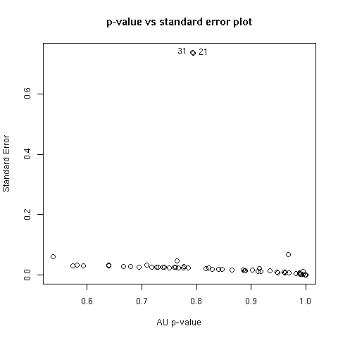

# pvclust

**An R package for hierarchical clustering with p-values**

- Ryota Suzuki (Ef-prime, Inc.)
- Yoshikazu Terada (Graduate School of Engineering Science, Osaka University)
- Hidetoshi Shimodaira (Graduate School of Informatics, Kyoto University)

## Overview
**pvclust** is an [R](https://www.r-project.org/) package for assessing the uncertainty in hierarchical cluster analysis. For each cluster in hierarchical clustering, quantities called p-values are calculated via multiscale bootstrap resampling. P-value of a cluster is a value between 0 and 1, which indicates how strong the cluster is supported by data.

pvclust provides two types of p-values: **AU** (Approximately Unbiased) p-value and **BP** (Bootstrap Probability) value. **AU** p-value, which is computed by multiscale bootstrap resampling, is a better approximation to unbiased p-value than **BP** value computed by normal bootstrap resampling.

pvclust performs hierarchical cluster analysis via function `hclust` and automatically computes p-values for all clusters contained in the clustering of original data. It also provides graphical tools such as `plot` function or useful `pvrect` function which highlights clusters with relatively high/low p-values. Furthermore, parallel computation is available with  `parallel` package.


An example of analysis on Boston data (in library `MASS`) is shown in the figure above. 14 attributes of houses are examined and hierarchical clustering has been done. Values on the edges of the clustering are p-values (%). Red values are **AU** p-values, and green values are **BP** values. Clusters with AU larger than 95% are highlighted by rectangles, which are strongly supported by data. 

## Installation

### Official release
pvclust can be easily installed from [CRAN](https://cran.r-project.org/). Run R on your machine (with internet access) and simply type as follows:
```r
install.packages("pvclust")
```
On Windows you can use `Packages -> Install package(s) from CRAN...` from menu bar. On macOS, you can use `Packages & Data -> Toggle Package Installer`. 

Source package is also available [here](https://cran.r-project.org/package=pvclust).

### Development version
You can also try development version from GitHub (`develop` branch). Please notice that some behavior in development version would be changed in an official release.
```
# install.packages("devtools")
devtools::install_github("shimo-lab/pvclust", ref="develop", subdir="src") 
```

## Basic usage and example
`example(pvclust)` will give you the idea of what the package can do, as well as how to use it. This example requires `MASS` package and may take about a few minutes. The source code of this example can be seen in `help(pvclust)`.

An example of DNA microarray data analysis is also available by `example(lung)`. Please be aware that this example may take ten or more minutes. If parallel computing is available on your machines (multicore PC or cluster environment), we recommend setting `parallel=TRUE` for example. See sample section of `help(pvclust)` or `help(lung)`. The result of the `lung` example is shown below.


## Instruction
This section gives a quick instruction about the usage of package pvclust. First load the package as follows:
```r
> library(pvclust)
```
Then load a data file into R object. In general, data files can be loaded using functions such as `read.table` or `read.csv`. Here we use a sample data set lung by function data as:
```r
> data(lung)
```
The data are contained in a `data.frame` object which has a matrix-like structure. For example, the first three entries (rows) of the first three variables (columns) can be accessed as:
```r
> lung[1:3,1:5]
```

|               | fetal_lung | 232-97_SCC | 232-97_node | 68-96_Adeno | 11-00_Adeno |
| ------------- | ---------- | ---------- | ----------- | ----------- | ----------- |
| IMAGE:196992  | -0.4       | 4.28       | 3.68        | -1.35       | -1.74       |
| IMAGE:587847  | -2.22      | 5.21       | 4.75        | -0.91       | -0.33       |
| IMAGE:1049185 | -1.35      | -0.84      | -2.88       | 3.35        | 3.02        |

In the `lung` data object, rows correspond to genes and columns to individuals. We conduct cluster analysis of individuals to classify individuals according to their expression patterns of genes. The main feature of pvclust is p-value calculation of clusters via multiscale bootstrap analysis.

Then we conduct hierarchical cluster analysis with multiscale bootstrap with number of bootstrap 1000, using average method and correlation-based dissimilarity matrix as follows: 
```r
> result <- pvclust(lung, method.dist="cor", method.hclust="average", nboot=1000, parallel=TRUE)
Creating a temporary cluster...done:
socket cluster with 7 nodes on host ‘localhost’
Multiscale bootstrap... Done
```
It took us about 2 minutes or less on our Intel (R) Core (TM) i7-8550U (4 cores 8 threads) Windows PC with 32GB RAM. Function `plot` displays the result of cluster analysis, and `pvrect` highlights clusters with high AU p-values, for example, higher than 0.95 as: 
```r
> plot(result)
> pvrect(result, alpha=0.95)
```


For a cluster with AU p-value > 0.95, the hypothesis that "the cluster does not exist" is rejected with significance level 0.05; roughly speaking, we can think that these highlighted clusters does not only "seem to exist" caused by sampling error, but may stably be observed if we increase the number of observation.

However, the AU p-values themselves include sampling error, since they are also computed by a limited number of bootstrap samples. The standard errors of AU p-values can graphically be checked by function `seplot` as: 


The plot shows there are some clusters whose standard values are extremely high (larger than 0.6 with AU p-values around 0.8). To examine these clusters more closely, interactive identification is also available by seplot with `identify=TRUE` option. Left-click the points of interest followed by typing as: 
```r
> seplot(result, identify=TRUE)
[1] 21 31
```


Right-click -> "Stop" to exit from the interactive mode (for Windows). The edge numbers of those clicked are printed in the plot, and also printed in the console. In this example, they are the 21st and 31st clusters. Then check the estimated values of these clusters with `print` function as: 
```r
> print(result, which=c(21, 31))

Cluster method: average
Distance      : correlation

Estimates on edges:

      au    bp se.au se.bp      v      c  pchi
21 0.795 0.999 0.733 0.002 -2.006 -1.184 0.976
31 0.793 0.999 0.737 0.002 -2.002 -1.184    NA
```

Take the 21st cluster for example. AU p-value is estimated as 0.795, with SE (standard error) 0.733. By an analogue of standard normal theory, the "true" AU p-value is roughly estimated to exist in between (AU - 2 * SE) and (AU + 2 * SE). From this rough inference, the true AU p-value seems to be in between -0.671 and 2.261. However AU is defined to be between 0 and 1, so this inference is of no meaning (Note: As shown in this example, the normal approximation fails for such large SE values. There is a better approximation for constructing confidence intervals based on z-values, though not yet implemented in our package. This feature will be included in a future release).

As this example shows, computation of AU p-value via multiscale bootstrap resampling requires comparatively large number of bootstrap sample size, which can be specified by `nboot` option. We recommend to use `nboot = 1000` for testing at first, and then use `nboot = 10000` for smaller error.

To obtain a clearer result, we conduct the same analysis with nboot = `10000`: 
```r
> result10k <- pvclust(lung, method.dist="cor", method.hclust="average", nboot=10000, parallel=TRUE)
Creating a temporary cluster...done:
socket cluster with 7 nodes on host ‘localhost’
Multiscale bootstrap... Done.
```
It took us about 19 minutes on our  Intel (R) Core (TM) i7-8550U  (4 cores 8 threads) Windows PC with 32GB RAM. This high time consumption is the primal reason why we recommend to test the program with `nboot = 1000` at first.

Now let us see how the result changed:
```r
> print(result10k, which=c(21, 31))

Cluster method: average
Distance      : correlation

Estimates on edges:

   au bp se.au se.bp      v      c  pchi
21  1  1     0     0 -4.042 -0.104 0.771
31  1  1     0     0 -4.102 -0.172 0.635
```

AU p-values changed to 1 with standard errors 0. In need of more precise expression, the precision of values can be changed with `digits` option as:
```r
> print(result10k, which=c(21, 31), digits=5)

Cluster method: average
Distance      : correlation

Estimates on edges:

        au      bp   se.au se.bp        v        c    pchi
21 0.99996 0.99998 0.00019 2e-05 -4.04168 -0.10436 0.77115
31 0.99996 0.99999 0.00025 2e-05 -4.10208 -0.17232 0.63527
```

This result suggests that the existence of these two clusters are strongly supported by data, with more than 99.9% confidence. We should also examine the standard errors of other clusters as well:
```r
> seplot(result10k)
```


As the plot shows almost all the clusters have standard errors smaller than 0.01. For those with somewhat higher values, we examine them with `identify` option and `print` function again:
```r
> x <- seplot(result10k, identify=TRUE)
```


```r
> x
[1] 2 65 67
> print(result10k, which=x)

Cluster method: average
Distance      : correlation

Estimates on edges:

      au    bp se.au se.bp      v      c  pchi
2  0.992 1.000 0.020 0.000 -3.157 -0.725 0.692
65 0.693 0.033 0.018 0.001  0.667  1.172 0.043
67 0.702 0.038 0.017 0.001  0.621  1.152 0.325
```

Now take our attention on the 2nd cluster. By applying 2 * SE rule again, the "true" AU p-value may exist between 0.952 and 1.0. Most commonly we adopt 95% significance level, so it seems to be enough stable to conclude that the existance of this cluster.

If you are more conservative and need 99% significance level, it is required to decrease the standard error down to 0.002, 10 times less than that of `nboot = 10000`. Generally to decrease the standard error of AU p-value down to A times less than current estimate, the number of bootstrap (`nboot`) should be increased by A^2 times. In this example, you may need 10,000 * 10^2 = 1,000,000 as the number of bootstrapping. In this example it seems to be reasonable to compromise with conclusion at 95% significance level.

If you are familiar with (or interested in) the algorithm of multiscale bootstrap resampling, its curve fitting process can be also accessed for diagnostic by function `msplot` as: 
```r
> msplot(result10k, edges=x)
```


Finally display the result with `nboot = 10000`. Although an overall results did not change from `nboot = 10000`, we are more confident of the estimation accuracy of AU p-values as well as the existance of highlighted clusters. 
```r
> plot(result10k)
> pvrect(result10k, alpha=0.95)
```


## Links
- [R](https://www.r-project.org/)
- [CRAN](https://cran.r-project.org/)
- [Shimodaira Laboratory](http://stat.sys.i.kyoto-u.ac.jp/)

---
For any questions or comments, please email to suzuki (at) ef-prime.com.